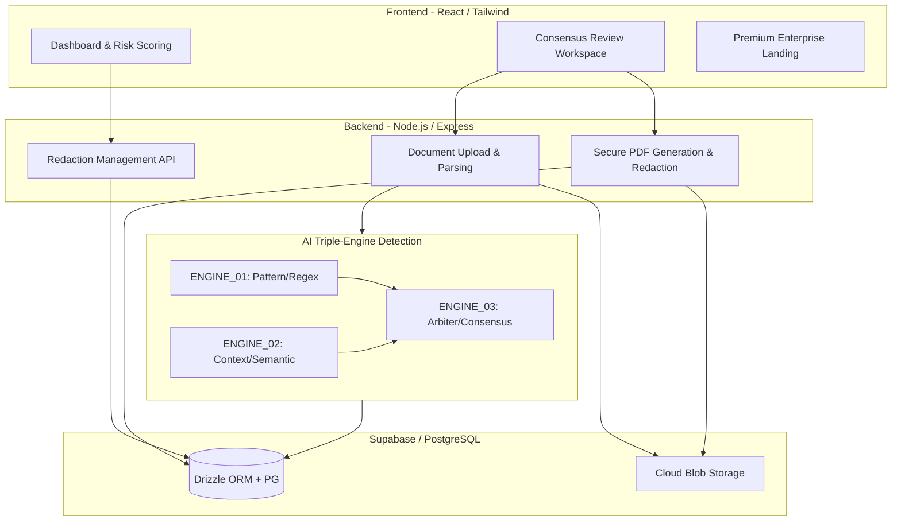

# Redact Review: Multi-Engine AI Privacy & PII Redaction

**Live Deployment Link:** [https://redactreview.onrender.com/](https://redactreview.onrender.com/)

Redact Review is an enterprise-grade document redaction platform built for the absolute privacy requirements of the legal and healthcare sectors. By utilizing a **Triple-Engine AI Consensus Framework**, the system identifies and redacts Personally Identifiable Information (PII) with deterministic extraction, semantic context mapping, and multi-model consensus arbitration, completely eliminating the liabilities associated with single-engine AI false negatives.

---

## 🏗️ System Architecture



---

## ✨ Key Features & The Consensus Methodology

### 1. Triple-Engine AI Consensus
We don't rely on one viewpoint. The platform utilizes multiple detection mechanisms working in tandem:
- **ENGINE_01 (Pattern):** Deterministic extraction using high-speed regex and structural analysis for strict formats (SSN, IBAN, Tax IDs).
- **ENGINE_02 (Context):** Semantic Mapping that analyzes surrounding language and prose to identify entities hidden in unstructured text.
- **ENGINE_03 (Arbiter):** Aggregates Engine 1 and 2, flagging discrepancies for human validation via "Second Opinion" smart alerts.

### 2. The Review Workspace ("Digital Paper" UX)
A highly polished, evaluator-focused review environment tailored for legal and medical reviewers. 
- **Side-by-side consensus mapping** and a **Privacy Readiness Score** ensuring documents only export when fully sanitized.
- **Severity Engine:** Calculates a risk-velocity score based on PII density, allowing reviewers to prioritize high-risk documents instantly.

### 3. Absolute PDF Redaction (Zero-Leak Generation)
The export engine doesn't just overlay visual blockers; it structurally alters the document:
- Modifies `.docx` files by explicitly stripping out the sensitive text spans.
- Converts to PDF with exact positional `bounding_boxes`, rendering `rgb(0,0,0)` redaction rectangles directly into the document layer while completely omitting the sensitive text strings from the underlying PDF text stream.

---

## 🛠️ Technical Stack

**Frontend:**
- **Framework:** React 18 / Vite
- **Styling:** Tailwind CSS (Custom Modern Corporate Aesthetic), Framer Motion for micro-interactions.
- **Routing:** Wouter / React Router
- **Component System:** Headless UI integrations + Lucide Icons.

**Backend:**
- **Runtime:** Node.js (v22/v26 environment support) / Express
- **PDF Generation:** `pdf-lib` for immutable document alterations and absolute positional geometry calculations.
- **Document Parsing:** `mammoth` for DOCX content extraction and positional mapping.

**Database & Cloud:**
- **Database:** Supabase (PostgreSQL)
- **ORM:** Drizzle ORM (Type-safe schema definitions for `documents`, `redactions`, `audit_reports`)
- **Hosting:** Render (Automated CI/CD deployment pipelines)

---

## 🎨 Design Philosophy
The brand personality is authoritative, secure, and precise. Built with a **Modern Corporate** aesthetic:
- **Color Palette:** Anchored by Oxblood Maroon (`#800000`) and Paper White (`#fff8f5`) to provide a professional, eye-strain-free canvas for long review sessions.
- **Typography:** **Inter** for dense, legible tabular data and UI layouts, paired with **JetBrains Mono** for PII entities, regex patterns, and exact metadata, cleanly distinguishing "system data" from "human text."
- **Depth & Shape:** Tonal layering for depth (omitting heavy drop-shadows), alongside subtle 4px borders mapping to a structured architectural feel.

---

## 🚀 Getting Started Locally

```bash
# Clone the repository
git clone https://github.com/your-username/SprintFour.git
cd SprintFour

# Install dependencies (Monorepo)
pnpm install

# Setup Environment Variables (.env)
VITE_SUPABASE_URL=...
SUPABASE_SERVICE_ROLE_KEY=...

# Start the local development servers (Frontend & Backend)
pnpm -C artifacts/api-server run build
node artifacts/api-server/dist/index.mjs &
pnpm -C artifacts/redact-review run dev
```

*Designed and developed to guarantee that your most critical data remains secure.*
